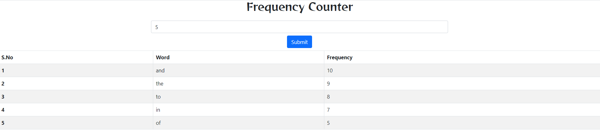
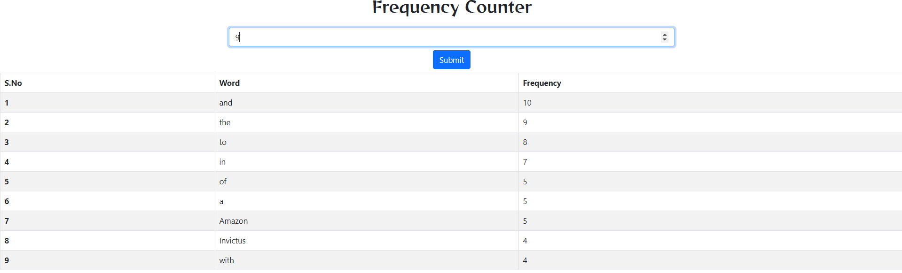
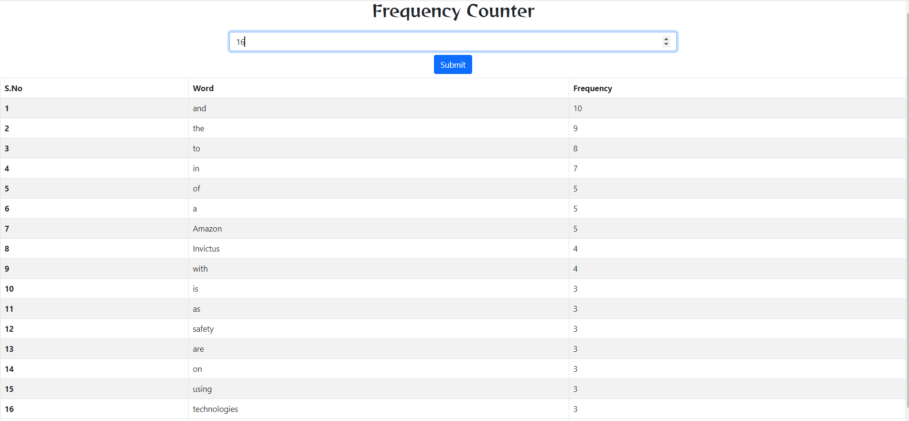
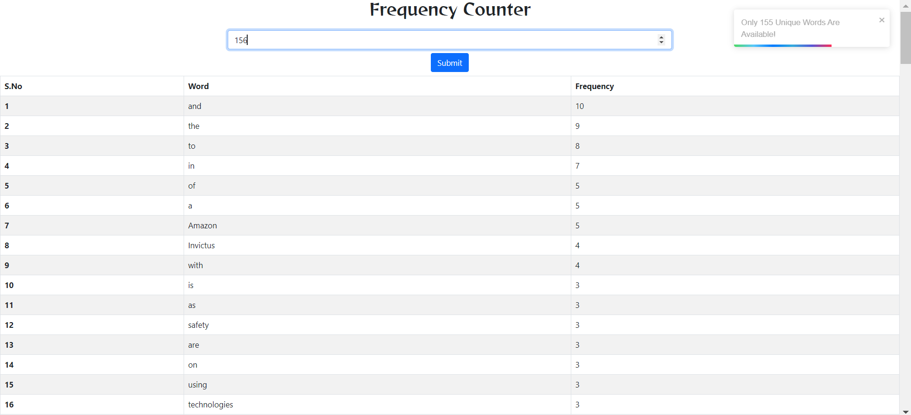

**About the Project**
This project helps us in finding the N most frequently occuring words in the paragraph which is fetched from a link given, also the N can be taken manually by the user input UI which is made in React.js.

**Component Used**
1) Table (JSX)
[Functional Component Used with React Hooks(useState).]

*This component fetch all the contents from the link given and compute frequency with their respective words and save them in differnt arrays using useState hook and finally return the component Table using array.map as a tabular format*

**Library Used**
1) react
2) react-dom
3) axios
4) react-toastify

**Test Cases with Screenshots**
*Test Case 1*

**N = 5**

*Test Case 2*

**N = 9**

*Test Case 3*

**N = 16**

*Test Case 4*

**N = 156**

**ThankYou Very Much**

